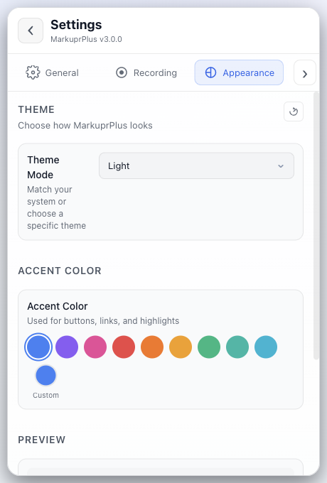
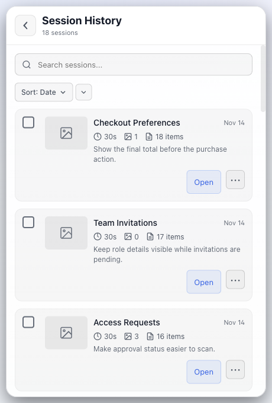
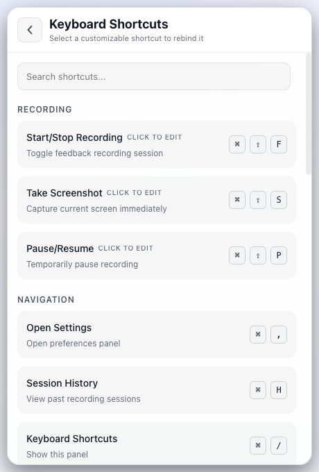
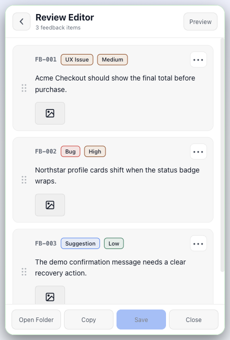
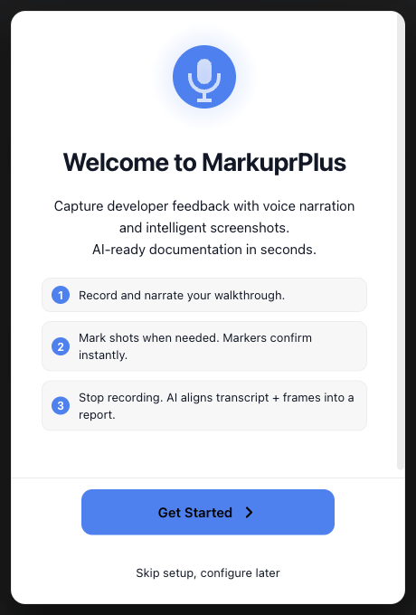

<p align="center">
  
</p>

<h1 align="center">MarkuprPlus</h1>

<p align="center">
  <strong>Capture the screen, narrate the problem, and hand an actionable report to your coding agent.</strong>
</p>

<p align="center">
  <a href="https://github.com/hashfunction/MarkuprPlus/actions/workflows/ci.yml"></a>
  <a href="LICENSE"></a>
  <a href="https://github.com/hashfunction/MarkuprPlus"></a>
</p>

<p align="center">
  <a href="https://markuprplus.com">Website</a> &middot;
  <a href="https://github.com/hashfunction/MarkuprPlus">Source</a> &middot;
  <a href="https://github.com/hashfunction/MarkuprPlus/issues">Issues</a> &middot;
  <a href="#source-quick-start">Quick start</a> &middot;
  <a href="#compatibility-and-release-status">Compatibility</a>
</p>

MarkuprPlus is an open-source desktop, CLI, and MCP toolchain for turning screen recordings, voice narration, live annotations, and capture context into structured feedback. The desktop workflow stays out of the way while recording, then opens a focused Review Editor where each finding can be checked before it is exported or delivered.

> **Release status:** the source repository is available now. There are no published desktop artifacts, GitHub Releases, npm package, or GitHub Action release yet. Build from source for evaluation. [markuprplus.com](https://markuprplus.com) is the canonical forthcoming product home, not a current download channel.

## Significantly enhanced from markupr

MarkuprPlus is a significantly enhanced evolution of [markupr](https://github.com/eddiesanjuan/markupr), retaining its fast screen-and-voice feedback workflow while extending it into a resilient desktop application and agent toolchain.

- Consistent portrait taskbar-popover UX for Settings, Session History, Keyboard Shortcuts, Review Editor, onboarding, completion, and error states
- Exact window, region, or display capture and live annotation with separately committed evidence
- Editable multi-issue review with categories, severity, screenshots, and deterministic report output
- Searchable Session History, bulk actions, exports, and crash recovery for interrupted work
- Local Whisper transcription with explicit local, CLI-backed, and hosted analysis-provider choices
- Desktop export, clipboard/open-folder actions, plus GitHub and Linear delivery paths
- Keyboard-first navigation, visible focus, reduced-motion and forced-colors support, and automated accessibility coverage
- Context-isolated preload access, guarded navigation, input/path/media validation, explicit credential-fallback disclosure, and provider-specific privacy controls

## Product tour

Click any thumbnail to open the full 460 × 680 capture.

<table>
  <tr>
    <td align="center"><a href="docs/images/markuprplus/settings.png"></a><br><sub>Settings</sub></td>
    <td align="center"><a href="docs/images/markuprplus/session-history.png"></a><br><sub>Session History</sub></td>
  </tr>
  <tr>
    <td align="center"><a href="docs/images/markuprplus/keyboard-shortcuts.png"></a><br><sub>Keyboard Shortcuts</sub></td>
    <td align="center"><a href="docs/images/markuprplus/review-editor.png"></a><br><sub>Review Editor</sub></td>
  </tr>
  <tr>
    <td colspan="2" align="center"><a href="docs/images/markuprplus/onboarding.png"></a><br><sub>Onboarding</sub></td>
  </tr>
</table>

## The desktop workflow

1. Start a recording from the tray/taskbar menu or the configurable global hotkey.
2. Select an exact window, a region, or a full display.
3. Narrate while you work. Hold Command on macOS or Control on Windows to draw over the recorded area without permanently taking mouse control from the target application.
4. Commit each marked finding separately; MarkuprPlus keeps its annotation, screenshot, and matching narration together.
5. Stop recording. Post-session transcription and frame extraction build the report; no live-transcription claim is required for capture to work.
6. Review, edit, categorize, reorder, or remove feedback before saving, copying, opening the output folder, or exporting.

Default hotkeys are `CmdOrCtrl+Shift+F` for Start/Stop, `CmdOrCtrl+Shift+S` for a manual frame cue, and `CmdOrCtrl+Shift+P` for Pause/Resume. They can be rebound in Settings.

## What is implemented

### Desktop application

- Menu-bar/taskbar operation with left-click popover behavior and a right-click menu for recording, Settings, Help, Contact, and platform-correct Quit/Exit
- Portrait 460 × 680 secondary surfaces with one intentional primary scroller
- Recording countdown, source selection, compact recording/processing HUDs, annotation fallback controls, and state watchdogs
- Review Editor and Session History with keyboard navigation, search, selection, delete, export, copy, and open-folder actions
- Recovery of persisted incomplete-session evidence after an interrupted run
- Theme, accent, output directory, launch-at-login, capture, audio, hotkey, analysis-provider, and diagnostic settings

### Transcription and analysis

Local Whisper performs post-session transcription when a downloaded model is available. Available model downloads range from 75 MB (tiny) through 3.1 GB (large); the base model is 142 MB. OpenAI transcription is an optional cloud recovery path when configured.

Report analysis is always backed by a Local Rules result and can use one selected provider:

| Provider | Connection | Data-flow note |
|---|---|---|
| Local Rules | Local | No model service; deterministic local report construction |
| Ollama | Local | Sends report input to the configured local Ollama server |
| LM Studio | Local | Sends report input to the configured local LM Studio server |
| Codex CLI | CLI | Uses the installed CLI and its signed-in service/account behavior |
| Claude Code CLI | CLI | Uses the installed CLI and its signed-in service/account behavior |
| Anthropic API | Cloud | Sends report input to Anthropic with the configured API key |

If the selected analysis provider is unavailable, the report records the fallback and uses Local Rules rather than silently switching to another model provider.

### Export and delivery

The desktop Review Editor exports Markdown, PDF, HTML, and JSON. Image inclusion is format-aware: Markdown copies colocated evidence when enabled, HTML/PDF can embed it, and JSON intentionally remains metadata-oriented.

The compatible CLI has five template names: `markdown`, `json`, `github-issue`, `linear`, and `jira`. GitHub and Linear issue delivery is available through the CLI/MCP integration code and sends the selected report content to those services only when invoked.

### CLI and MCP

The CLI processes existing recordings, watches directories, runs diagnostics, initializes configuration, and can deliver reports. The MCP server registers nine tools:

- `capture_screenshot`
- `describe_screen`
- `capture_with_voice`
- `analyze_video`
- `analyze_screenshot`
- `start_recording`
- `stop_recording`
- `push_to_github`
- `push_to_linear`

See [README-MCP.md](README-MCP.md) and [docs/AI_AGENT_QUICKSTART.md](docs/AI_AGENT_QUICKSTART.md) for source-run configuration.

## Privacy and security

Capture files, transcripts, screenshots, and reports are stored in the configured output directory. Local Whisper, Local Rules, Ollama, and LM Studio can keep the processing path on the machine when their services are local. Choosing OpenAI transcription, Anthropic API, Codex CLI, Claude Code CLI, GitHub, Linear, or screen-description tools can transmit selected audio, text, images, or report content according to that provider's behavior.

MarkuprPlus does not add application telemetry or analytics. API-key storage first tries the operating system credential service, then Electron `safeStorage` encryption. If both are unavailable, the current compatibility behavior can write the key to an owner-only plaintext `secure-keys.json` fallback. Omit hosted API keys from MarkuprPlus unless the supported keychain or `safeStorage` is available; local Whisper and Local Rules require no hosted key. Renderer navigation is guarded, IPC is exposed through the preload boundary, and external links are opened through explicit handlers.

See [SECURITY.md](SECURITY.md) before reporting a vulnerability.

## Source quick start

### Requirements

- Node.js 20.9 or newer
- npm
- ffmpeg on `PATH`
- macOS for the currently exercised desktop integration and packaging path; x64 and arm64 builds are configured

Windows packaging is configured but should be treated as pre-release until a signed artifact is independently validated. Linux desktop packaging remains future-facing. The Node-based CLI/MCP code is intended to be portable where Node, ffmpeg, and the required native modules are supported.

### Run from source

```bash
git clone https://github.com/hashfunction/MarkuprPlus.git
cd MarkuprPlus
npm install
npm run dev
```

Build every interface:

```bash
npm run build
node dist/cli/index.mjs --help
node dist/mcp/index.mjs
```

The desktop app needs microphone and screen-recording permission. macOS also uses Accessibility permission for reliable global modifier observation during live annotation; the app provides explicit fallback controls when that observation is unavailable.

## Compatibility and release status

The retained compatibility names are reserved for publication: the npm/package and CLI identity remains `markuprx`, and the MCP binary remains `markuprx-mcp`. Those identifiers are intentionally unchanged so existing automation and future package publication do not require a machine-level migration.

Other retained compatibility surfaces include `.markuprx.json`, the `.markuprx` session extension, `window.markuprx`, `markuprx:` IPC channels, `MARKUPRX_*` environment variables, `com.markuprx/markuprx`, `~/Documents/markuprx`, and `~/.markuprx`. Public application windows, installers, reports, and current documentation use MarkuprPlus.

After the package is published, the reserved command forms will remain:

```bash
npx markuprx analyze ./recording.mov
npx --package markuprx markuprx-mcp
```

They are documented for compatibility and are not a statement that the npm package is currently available.

## Development and verification

```bash
npm run verify:source
npm run test:ui-electron
npm run build
```

`verify:source` runs the repository brand audit, lint, typecheck, unit/integration coverage, and the desktop build. Real-Electron tests cover the packaged renderer/main-process boundary, portrait UX, recording flow, recovery, keyboard access, and public screenshot states.

See [CONTRIBUTING.md](CONTRIBUTING.md) for development conventions and pull-request expectations.

## Support and license

- Product home: [markuprplus.com](https://markuprplus.com) (forthcoming)
- Source: [github.com/hashfunction/MarkuprPlus](https://github.com/hashfunction/MarkuprPlus)
- Bugs and requests: [GitHub Issues](https://github.com/hashfunction/MarkuprPlus/issues)
- Contact: [Open a new issue](https://github.com/hashfunction/MarkuprPlus/issues/new)

MIT licensed. See [LICENSE](LICENSE).
