<p align="center">
  
</p>

<h1 align="center">MarkuprPlus</h1>

<p align="center">
  <strong>You see it. You say it. Your AI fixes it.</strong>
</p>

<p align="center">
  <a href="marketing-video/markuprplus-explainer-v10b-four-step-tour-natural-agent.mp4">
    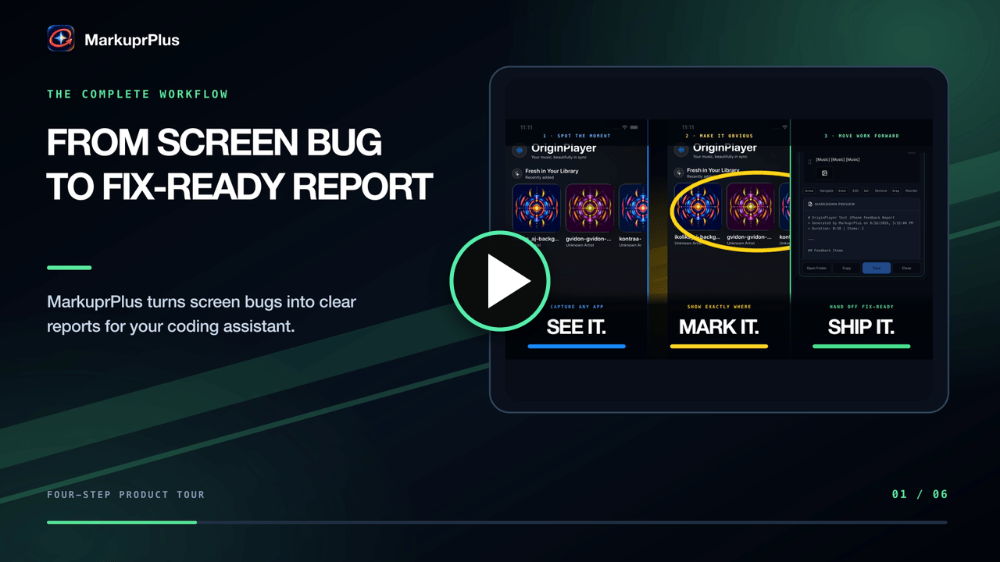
  </a>
</p>

<p align="center">
  <a href="marketing-video/markuprplus-explainer-v10b-four-step-tour-natural-agent.mp4"><strong>▶ Watch the 33-second product tour</strong></a>
</p>

<p align="center">
  Pick a window. Talk through what's wrong. Circle it while it happens.<br>
  Every circle becomes its own issue, with its own screenshot, ready to paste into your coding agent.
</p>

<p align="center">
  <a href="https://github.com/hashfunction/MarkuprPlus/actions/workflows/ci.yml?query=branch%3Amain"></a>
  <a href="https://github.com/hashfunction/MarkuprPlus/actions/workflows/deploy-landing.yml?query=branch%3Amain"></a>
  
  
  
  <a href="LICENSE"></a>
</p>

<p align="center">
  <a href="#quick-start">Quick Start</a> &middot;
  <a href="#the-loop">The Loop</a> &middot;
  <a href="#what-lands-in-your-folder">Output</a> &middot;
  <a href="#every-surface">Screenshots</a> &middot;
  <a href="#report-providers">Providers</a> &middot;
  <a href="#mcp-server">MCP</a> &middot;
  <a href="#cli">CLI</a>
</p>

---

<p align="center">
  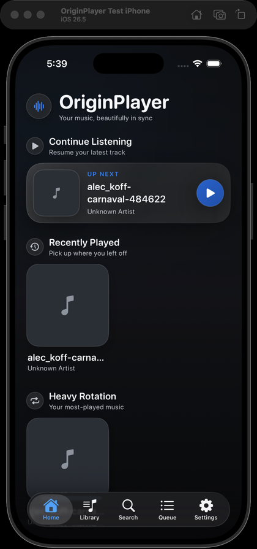
  &nbsp;&nbsp;
  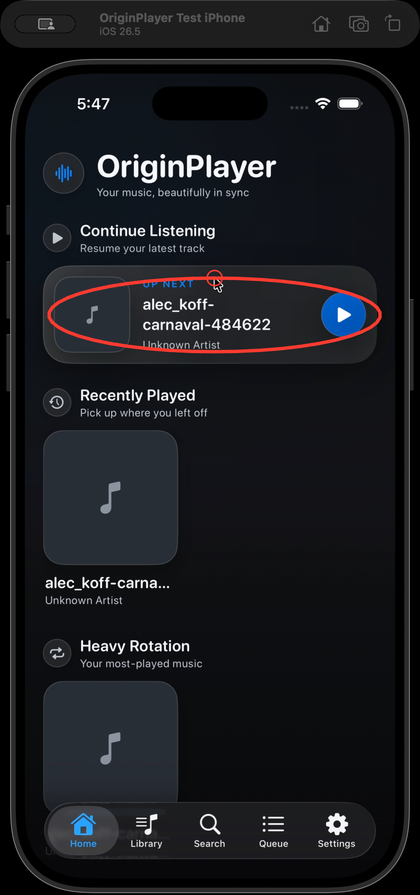
</p>

<p align="center">
  <em>Hold <code>Cmd</code>, circle the problem, keep talking. That stroke becomes <code>MX-001</code>.</em>
</p>

## The Problem

Your coding agent can't see your screen. So you stop working and start transcribing: describe the layout bug in prose, take a screenshot, crop it, drag it into the right place, explain which part matters. You speak at 150 words per minute and type at 60, and the context leaks out on the way.

## The Solution

MarkuprPlus is a menu bar app. It records the exact window you point at, listens while you narrate, and lets you draw on the live screen without blocking your clicks. When you stop, it transcribes on-device, aligns your words to each mark, and writes a report your agent can act on — one finding per circle, each with its own annotated frame.

```
Cmd+Shift+F  →  talk  →  Cmd-drag  →  Cmd+Shift+F  →  paste into your agent
```

## The Loop

### 1. Press `Cmd+Shift+F` and pick your target

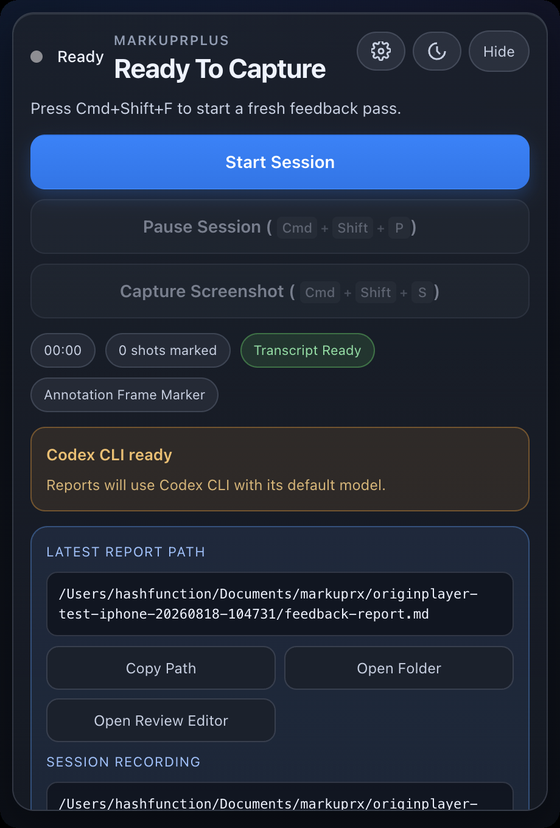

The picker opens above every window. Whatever is under your cursor lights up — click it and the recorder locks onto that window alone, and stays locked through moves, resizes, and app switches. Region and full-display modes are one click away when a finding needs a wider frame.

If the window's identity or native geometry ever becomes ambiguous mid-session, capture **stops** rather than widening to whatever is behind it. You never ship a frame you didn't mean to share.

The whole app lives in this one portrait popover. No window to manage, no dock icon.

<br clear="right">

### 2. Talk while you work

Keep clicking through your app as usual. MarkuprPlus records the window and your microphone together, then transcribes with Whisper on-device after you stop.

The picker, the drawing canvas, and the recording HUD are all excluded from screen capture at the OS level — **nothing MarkuprPlus draws ends up in your video.** Only your app does, plus the strokes you meant to leave.

### 3. Hold `Cmd` and draw

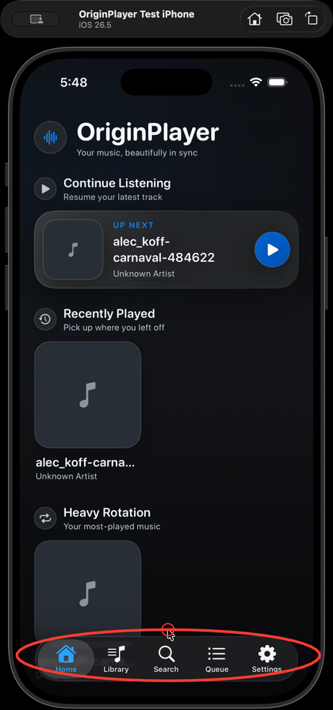

Command-drag paints straight onto the live screen — freehand, circle, or highlight, in a colour you choose. Let go of the key and your next normal click both reaches the app underneath **and** saves that mark, clearing the canvas for the next one.

On Windows, hold `Ctrl` instead.

Three circles means three issues, not one screenshot with three scribbles on it. Each finding carries its own PNG, timestamp, tool, and colour.

<br clear="right">

### 4. Press `Cmd+Shift+F` again

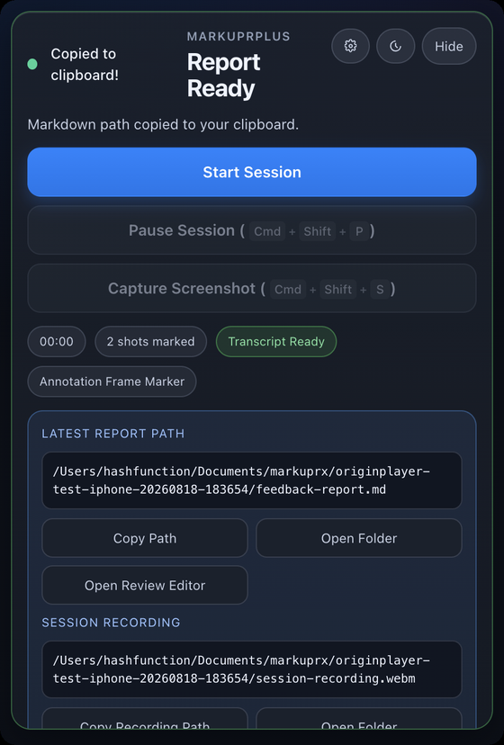

Whisper runs, your narration is aligned to each mark, and the report is written to disk. The markdown path lands on your clipboard the moment it's ready — paste it straight into Claude Code, Codex, Cursor, or anything else that reads a file.

Everything for the session goes in one folder: the report, the screenshots, the session video, the narration audio, and the metadata.

<br clear="right">

## Quick Start

### Desktop app (recommended)

Download from [markuprplus.com](https://www.markuprplus.com) or the [releases page](https://github.com/hashfunction/MarkuprPlus/releases/latest). macOS on Apple Silicon and Intel, plus Windows.

> **macOS install note:** Direct downloads from GitHub Releases are signed, notarized, and stapled. If Gatekeeper rejects an artifact, use [MarkuprPlus support](https://markuprplus.com/support) so the release can be investigated.

1. Press `Cmd+Shift+F` (macOS) or `Ctrl+Shift+F` (Windows) and click the window you want.
2. Narrate what you see. Hold `Cmd` / `Ctrl` and drag to mark the live screen.
3. Release the key, then click normally — that saves the mark and clears the canvas. Repeat for every finding.
4. Press the hotkey again to stop. The report path is on your clipboard.

### MCP server (for AI coding agents)

```bash
npx --yes --package markuprplus markuprplus-mcp
```

### CLI (for recordings you already have)

```bash
npx markuprplus analyze ./recording.mov
```

> **Compatibility:** the public package and commands are `markuprplus` and
> `markuprplus-mcp`. Existing `.markuprx` project files, storage paths, and app
> identifiers remain unchanged so upgrades keep their settings and sessions.

### Optional companion for Mac App Store CLI integrations

The sandboxed Mac App Store app can use AI command-line tools already installed and signed in on your Mac through the optional MarkuprPlus CLI Bridge. Local Rules, Ollama, LM Studio, and Anthropic API do not require this companion.

Install and pair it from a Terminal:

```bash
npm install -g markuprplus
markuprplus bridge install     # installs and starts a per-user LaunchAgent
markuprplus bridge token       # paste this value in Settings → Advanced
markuprplus bridge status
```

The public npm package contains the same versioned CLI and MCP entry points used
by the source release.

The service listens only on `127.0.0.1:49647`, requires its random pairing token for every provider request, and accepts a fixed structured-report protocol rather than shell text. The App Store app does not run shell commands or launch external tools; the separately installed companion invokes only the provider selected in Settings.

Lifecycle and recovery commands:

```bash
markuprplus bridge start
markuprplus bridge stop
markuprplus bridge status
markuprplus bridge token
markuprplus bridge rotate-token
markuprplus bridge uninstall
```

Rotating the token requires pairing again. Uninstall removes the exact LaunchAgent and bridge configuration owned by MarkuprPlus; it does not uninstall your AI CLIs.

## What Lands in Your Folder

One session, one directory:

```
originplayer-test-iphone-20260818-104731/
├── feedback-report.md          # the file you paste
├── feedback-summary.md         # counts and duration
├── metadata.json               # per-issue capture context
├── processing-trace.json       # which provider ran, how long, why it fell back
├── screenshots/
│   ├── marked-issue-001.png    # one frame per mark, your stroke composited in
│   ├── marked-issue-002.png
│   └── marked-issue-003.png
├── session-recording.webm      # the window, with annotations
└── session-audio.webm          # your narration
```

A real, unedited finding from that session:

```markdown
### MX-001

- **Timestamp:** 00:08
- **Tools:** freehand
- **Colors:** #ff3b30

#### User Comment

> So there's a search menu and over here by default, if there's been
> previous searches, it should list out all the searches that have
> happened in the past.

#### Marked Evidence


```

Each finding carries more than pixels:

| What travels with the issue | Example |
|---|---|
| Its own annotated PNG | `screenshots/marked-issue-001.png` |
| The narration at that moment | `transcript-segment-0001 … 0002` |
| How you marked it | `freehand · #ff3b30` |
| Where it came from | `window:5976:0` · `OriginPlayer Test iPhone` · `darwin` |
| Cursor, active app, and focus hints | captured at the instant you drew |
| Trigger metadata | `annotation`, `manual`, `pause`, or `voice-command` |

Marked issues are numbered `MX-001…`; items that come from narration alone are `FB-001…`.

## Every Surface

<table>
  <tr>
    <td width="33%" valign="top">
      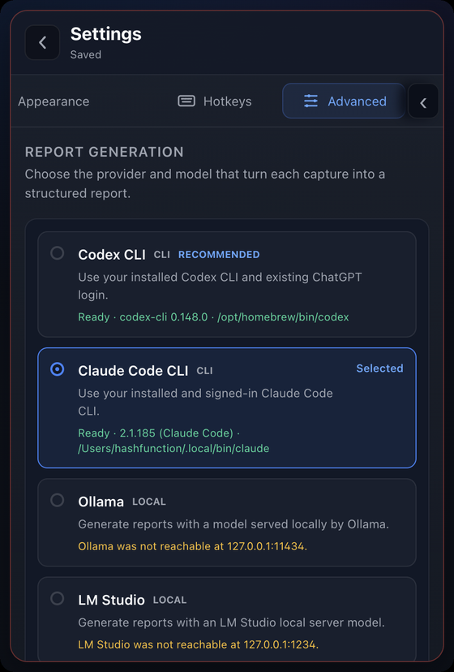<br>
      <strong>Report providers</strong><br>
      Fifteen ways to turn a session into a report, each showing whether it's reachable <em>right now</em> — CLI version and path, local port, missing key.
    </td>
    <td width="33%" valign="top">
      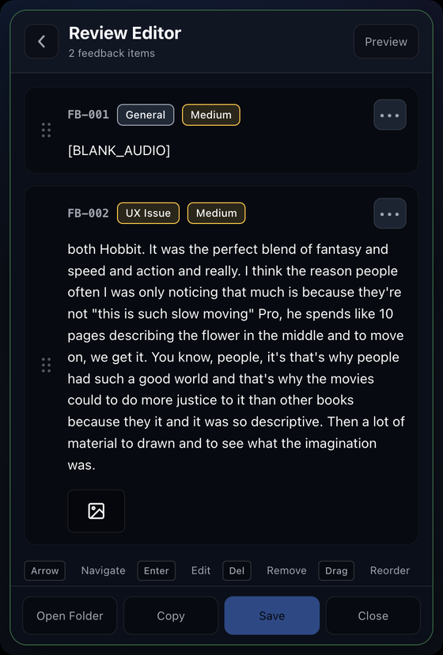<br>
      <strong>Review editor</strong><br>
      Reorder findings, retitle them, change category and severity, and drop the ones that were just thinking out loud.
    </td>
    <td width="33%" valign="top">
      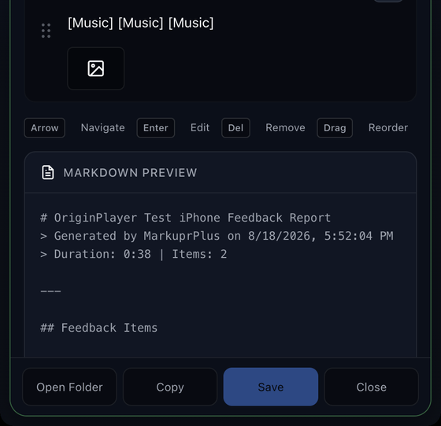<br>
      <strong>Live markdown preview</strong><br>
      See the exact file your agent will read before you save it. Copy it, open the folder, or export.
    </td>
  </tr>
  <tr>
    <td valign="top">
      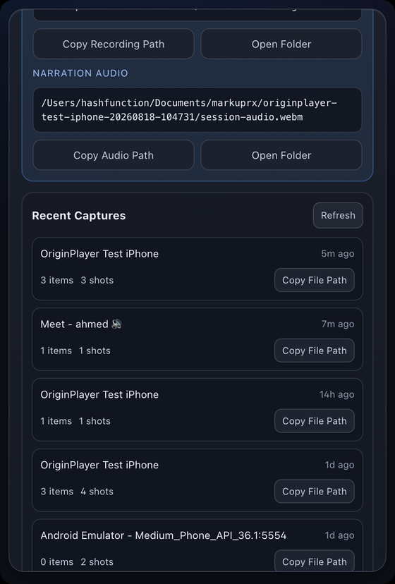<br>
      <strong>Recent captures</strong><br>
      Every session stays on disk with its item and shot counts. Copy any report path back without hunting through Finder.
    </td>
    <td valign="top">
      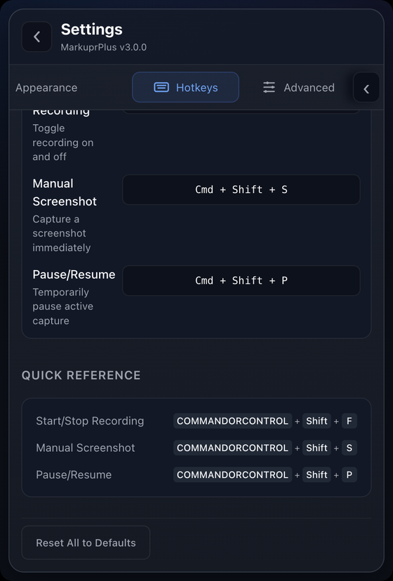<br>
      <strong>Hotkeys</strong><br>
      Record, screenshot, and pause are global and rebindable, with the quick reference kept in the panel.
    </td>
    <td valign="top">
      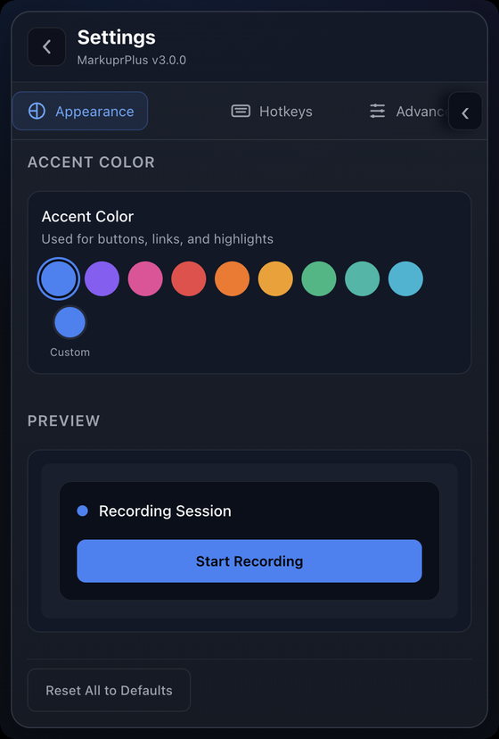<br>
      <strong>Appearance</strong><br>
      Ten accent colours plus a custom picker, previewed live. Light and dark follow the system.
    </td>
  </tr>
  <tr>
    <td valign="top">
      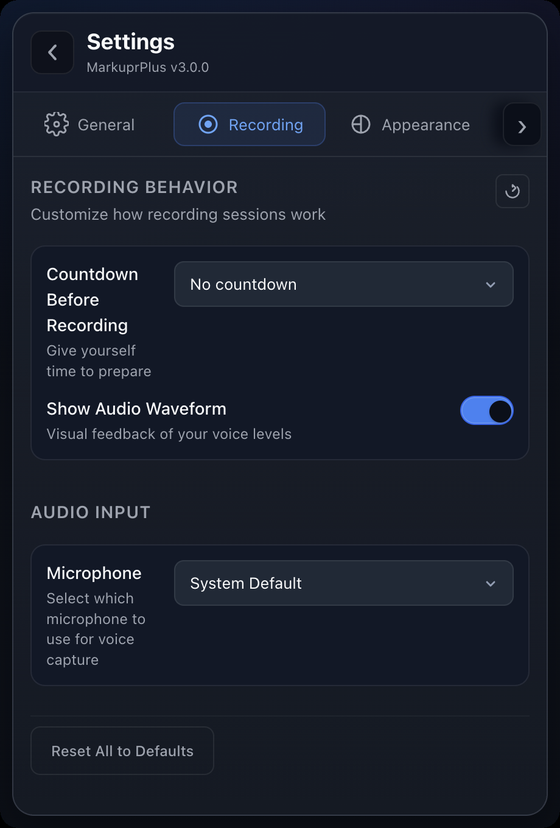<br>
      <strong>Recording &amp; audio</strong><br>
      Countdown before recording, audio waveform feedback, and microphone selection.
    </td>
    <td valign="top">
      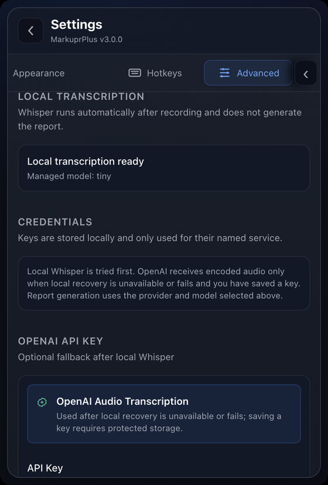<br>
      <strong>Transcription &amp; keys</strong><br>
      Whisper runs locally first. OpenAI only receives audio if local recovery fails <em>and</em> you saved a key.
    </td>
    <td valign="top">
      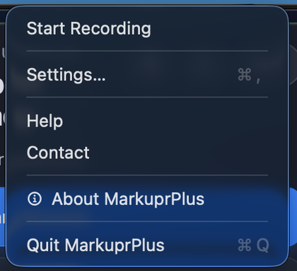<br>
      <strong>Menu bar</strong><br>
      Start a recording, jump to settings, or quit — without opening the popover at all.
    </td>
  </tr>
</table>

## Report Providers

Pick the model that turns a capture into a structured report. MarkuprPlus checks each one **before** you record and shows you what it actually found.

In the Mac App Store app, CLI providers use the optional local companion described above. Direct desktop builds invoke the same adapters inside the app. Both paths preserve Local Rules as the failure-safe report.

| Provider | Kind | What it uses |
|---|---|---|
| **Codex CLI** | CLI | Your installed Codex CLI and existing ChatGPT login, in a read-only ephemeral session |
| **Claude Code CLI** | CLI | The Claude Code CLI you're already signed in to |
| **OpenCode** | CLI | Your configured OpenCode provider, with a per-run agent that denies every tool action |
| **Cursor Agent CLI** | CLI | Cursor Agent in non-interactive, read-only Ask mode |
| **Qwen Code** | CLI | Qwen Code in safe, non-interactive plan mode with mutation tools excluded |
| **Goose** | CLI | Your configured Goose provider in tool-free chat mode, without profiles or session persistence |
| **Amp** | CLI | Your Amp login with an isolated default-deny tool policy |
| **Kiro CLI** | CLI | Kiro headless mode with only read and grep trusted |
| **Aider** | CLI | Your configured Aider model in dry-run, no-git mode |
| **Ollama** | Local | A model served on `127.0.0.1:11434` — nothing leaves the machine |
| **LM Studio** | Local | An LM Studio server on `127.0.0.1:1234` |
| **Anthropic API** | Cloud | Your own key, stored in the system keychain and used for nothing else |
| **Local rules** | Zero setup | Deterministic report from transcript and marks alone, no credentials |

**Failure is safe by design.** If the provider you picked errors out, the deterministic Local rules report is written anyway, and the popover names the provider and the reason. Your recording, audio, and marks were already on disk before analysis started. An explicit CLI choice never silently becomes an Anthropic call.

Codex CLI and OpenCode can receive captured screenshots. Transcript-only CLI adapters reject screenshot-only sessions instead of inventing visual findings.

`processing-trace.json` records exactly what happened:

```json
{
  "requestedProvider": "codex-cli",
  "actualProvider": "rules",
  "aiFallbackReason": "Codex analysis exited with status 1.",
  "aiEnhanced": false,
  "totalMs": 4220
}
```

## Why MarkuprPlus

**Evidence, not footage.** A screen recording leaves your agent a video it can't watch and you a file you have to narrate twice. This gives you separate findings, one annotated frame each, the words you said at that timestamp, and the window and cursor context.

**Local-first.** Whisper runs on your device and Local rules needs no credentials. Cloud transcription and cloud models only run when you explicitly pick them. No account, no telemetry, no analytics.

**It doesn't film itself.** The picker, the drawing canvas, and the recording HUD are content-protected at the OS level. Your marks reach the report; the app's own chrome never reaches the video.

**Works everywhere.** Desktop app for daily flow, CLI for scripts and CI, MCP server for agents, GitHub Action for pull requests. One pipeline, four front doors.

**Open source.** MIT licensed. Read it, fork it, ship it.

## MCP Server

Give your agent eyes and ears. It can capture screenshots, record your screen with voice, and receive structured reports mid-conversation.

**Claude Code** (`~/.claude/settings.json`), Cursor, and Windsurf all take the same shape:

```json
{
  "mcpServers": {
    "MarkuprPlus": {
      "command": "npx",
      "args": ["--yes", "--package", "markuprplus", "markuprplus-mcp"]
    }
  }
}
```

### Tools

| Tool | Description |
|------|-------------|
| `capture_screenshot` | Grab the current screen with cursor, active app/window, and focus hints attached. |
| `capture_with_voice` | Record screen and mic for a set duration, and return a structured report. |
| `describe_screen` | Describe what's currently on screen. |
| `start_recording` | Begin an interactive recording session. |
| `stop_recording` | End the session and run the full pipeline. |
| `analyze_video` | Process an existing `.mov` / `.mp4` into Markdown with extracted frames. |
| `analyze_screenshot` | Run a single screenshot through the analysis pipeline. |
| `push_to_github` | Create GitHub issues from a report. |
| `push_to_linear` | Create Linear issues from a report. |

```
You: "The sidebar is overlapping the main content on mobile. Can you see it?"

Agent: [calls capture_screenshot]
       "I can see it — the sidebar is position: fixed with no z-index,
        280px wide with no responsive breakpoint. Fixing the CSS..."
```

Full MCP documentation: [README-MCP.md](README-MCP.md).

## CLI

```bash
npx markuprplus analyze ./recording.mov
```

| Command | What it does |
|---|---|
| `markuprplus analyze <video>` | Turn an existing recording into a structured report |
| `markuprplus watch [dir]` | Process new recordings from a folder as they land |
| `markuprplus doctor` | Check your environment for dependencies and configuration |
| `markuprplus init` | Scaffold configuration |
| `markuprplus push github <report>` | Create GitHub issues from a report |
| `markuprplus push linear <report>` | Create Linear issues from a report |

```bash
markuprplus analyze ./recording.mov --output ./reports
markuprplus analyze ./recording.mov --template github-issue
markuprplus analyze ./recording.mov --no-frames        # transcript only
markuprplus watch ~/Desktop --output ./reports
markuprplus push github ./report.md --repo myorg/myapp --dry-run
```

**Output templates:** `markdown` (default) · `json` · `github-issue` · `linear` · `jira`
The desktop app also exports `html` and `pdf`.

**Requirements:** Node.js 20.9+ and [ffmpeg](https://ffmpeg.org/) on your `PATH` (`brew install ffmpeg` / `apt install ffmpeg` / `choco install ffmpeg`).

<p align="center">
  
</p>

## Integrations

### GitHub Action

Analyze recordings in CI and post structured feedback on the pull request that needs it:

```yaml
- uses: eddiesanjuan/markuprx-action@v1
  with:
    video-path: ./recordings/
    github-token: ${{ secrets.GITHUB_TOKEN }}
    create-issues: 'true'
```

See [markuprx-action/README.md](markuprx-action/README.md) for every input.

### Issue trackers

Push each finding straight into GitHub Issues or Linear — screenshot, narration, timestamp, and capture context already formatted — from the app, the CLI, or your agent over MCP.

## Keyboard Shortcuts

| Action | macOS | Windows |
|---|---|---|
| Start / stop recording | `Cmd+Shift+F` | `Ctrl+Shift+F` |
| Mark the live screen | hold `Cmd` and drag | hold `Ctrl` and drag |
| Manual screenshot | `Cmd+Shift+S` | `Ctrl+Shift+S` |
| Pause / resume | `Cmd+Shift+P` | `Ctrl+Shift+P` |
| Settings | `Cmd+,` | `Ctrl+,` |

Recording, screenshot, and pause are global and rebindable in **Settings → Hotkeys**. Full reference: [docs/KEYBOARD_SHORTCUTS.md](docs/KEYBOARD_SHORTCUTS.md).

## How It Works

```
                    +-----------+
  Screen + Voice -> | Whisper   | -> Timestamped transcript
                    +-----------+
                         |
                    +-----------+
                    | Aligner   | -> Marks matched to the words around them
                    +-----------+
                         |
                    +-----------+
                    | Provider  | -> Structure and severity (or local rules)
                    +-----------+
                         |
                    +-----------+
                    | Generator | -> Markdown, HTML, JSON, PDF, or tracker-ready
                    +-----------+
```

The pipeline degrades gracefully at every step. No ffmpeg? Transcript-only output. No Whisper model? Timer-based screenshots. No provider? Local rules. A failure anywhere still leaves you a report and the raw session on disk.

For architecture details, see [CLAUDE.md](CLAUDE.md).

## Development

```bash
npm install
npm run dev
```

| Command | Description |
|---------|-------------|
| `npm run dev` | Development mode with hot reload |
| `npm run build` | Build everything (desktop + CLI + MCP) |
| `npm test` | Run all tests |
| `npm run lint` | Lint |
| `npm run typecheck` | Type check |

## Contributing

1. Fork the repository
2. Create a feature branch: `git checkout -b feature/your-feature`
3. Run tests: `npm test && npm run lint && npm run typecheck`
4. Open a Pull Request

See [CONTRIBUTING.md](CONTRIBUTING.md) for full guidelines.

## License

MIT — see [LICENSE](LICENSE).

---

<p align="center">
  <a href="https://www.markuprplus.com">www.markuprplus.com</a>
</p>
